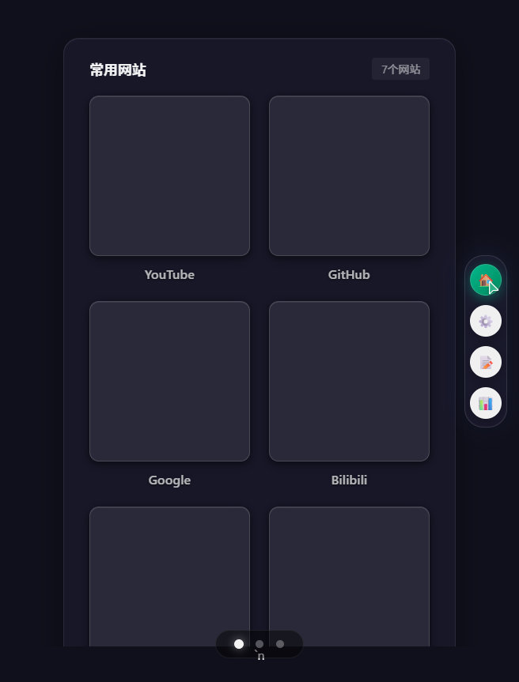
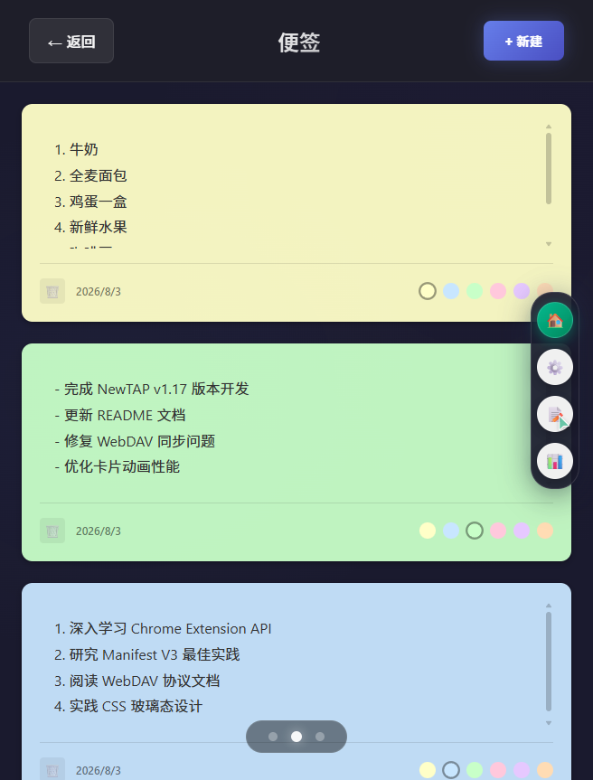
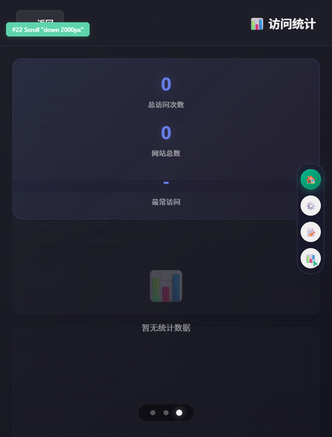

# NewTAP - 新标签页扩展

一个美观、实用的 Chrome/Edge 浏览器新标签页扩展，支持自定义书签、WebDAV 同步、便签、访问统计、网站监控等功能。


## 功能特性

### 核心功能
- **自定义书签** - 添加、编辑、删除常用网站书签，支持拖拽排序
- **LOGO 搜索** - 编辑书签时可从百度、搜狗、必应搜索网站 LOGO
- **图标库** - 内置 38 个常用网站的设计 LOGO（128×128 品牌渐变圆角方形，随扩展离线可用），编辑书签时一键选用；按访问统计前 30 自动列出「我的常用」并匹配设计 LOGO；支持把自己的图标存进「我的收藏」
- **WebDAV 同步** - 通过 WebDAV 同步书签到飞牛 NAS 等存储服务，支持自动同步与启动时同步
- **便签功能** - 内置便签系统，支持创建和管理多个便签，6 种颜色变体
- **访问统计** - 统计网站访问次数，点击卡片可直接访问

### 视觉与交互
- **设计系统** - 完整的 CSS Token 系统（颜色 / 阴影 / 模糊 / 圆角 / 间距 / 字体）
- **玻璃态风格** - `backdrop-filter: blur()` 玻璃态卡片与侧边栏
- **卡片视觉特效** - 3D 变换、多层发光阴影、边缘光效、粒子/光晕/霓虹动画
- **罗盘时钟** - 独特的指南针时钟设计
- **右侧导航栏** - 首页/设置/便签/统计按钮在所有页面统一可达
- **响应式设计** - 适配桌面、平板、移动端
- **无障碍** - 支持 `prefers-reduced-motion`

## 安装方法

### 开发者模式安装（推荐）

1. 下载本仓库代码并解压
2. 打开 Chrome/Edge 浏览器，进入扩展管理页面 (`chrome://extensions/` 或 `edge://extensions/`)
3. 开启右上角的"开发者模式"
4. 点击"加载已解压的扩展程序"
5. 选择解压后的文件夹

## 使用方法

### 基本操作

- **添加书签**：点击页面上的"+"按钮或右键菜单
- **编辑书签**：右键点击书签图标选择编辑，可搜索并选择 LOGO
- **图标库**：编辑书签时点「🖼 图库」选用内置设计 LOGO
  - 「我的常用」按浏览器访问统计（前 30 个站点）排列，命中内置 LOGO 的自动用设计稿
  - 「全部预设」可浏览 38 个常用网站 LOGO，支持按名称/域名搜索
  - 「我的收藏」可存放自己保存的图标（点「➕ 保存当前图标到图库」）
  - 选中后图标会转成 PNG 存进书签，离线可用、跨设备同步显示一致
  - 设置 → 图标库 →「🎨 套用预设图标」可一次性给已添加的网站换上设计 LOGO（只替换默认 favicon，不动自定义图标）
- **删除书签**：右键点击书签图标选择删除
- **拖拽排序**：长按书签卡片可拖拽调整位置
- **页面导航**：滚轮滑动或点击底部导航切换页面

### WebDAV 同步设置

1. 点击右上角的设置图标
2. 选择"同步设置"
3. 输入 WebDAV 服务器地址、用户名和密码
4. 点击"测试连接"验证配置
5. 启用自动同步或手动点击同步按钮

#### 飞牛NAS WebDAV 配置示例

- **服务器地址**：`http://你的NAS地址:5005/webdav/`
- **用户名**：你的飞牛NAS用户名
- **密码**：你的飞牛NAS密码

## 文件结构

```
新标签页/
├── manifest.json              # 扩展配置文件（Manifest V3）
├── newtab.html                # 新标签页主页面
├── popup.html / popup.js      # 扩展弹窗
├── background.js              # Service Worker 后台脚本
├── css/                       # 样式文件
│   ├── base.css               # 设计 Token 系统、变量
│   ├── components.css         # 组件样式（卡片、按钮、导航栏）
│   ├── pages.css              # 页面样式（便签/统计/监控）
│   └── animations.css         # 动画效果
├── js/                        # JavaScript 模块
│   ├── main.js                # 应用主入口
│   ├── UIManager.js           # UI 管理器
│   ├── BookmarkManager.js     # 书签管理器
│   ├── SettingsManager.js     # 设置管理器
│   ├── StatsManager.js        # 统计管理器
│   ├── BackupManager.js       # 备份管理器
│   ├── StickyNoteManager.js   # 便签管理器
│   ├── IconCache.js            # 图标持久化缓存（IndexedDB）
│   ├── Compass.js             # 罗盘时钟组件
│   ├── sync/                  # 同步模块
│   │   ├── WebDAVClient.js    # WebDAV 客户端
│   │   ├── DataMerger.js      # 数据合并（基于时间戳）
│   │   ├── WebDAVSyncManager.js
│   │   ├── AutoSyncManager.js # 自动同步
│   │   └── index.js
│   └── ui/                    # UI 渲染模块
│       ├── BookmarkRenderer.js
│       ├── StickyNotesRenderer.js
│       ├── StatsRenderer.js
│       ├── PageNavigator.js
│       └── index.js
├── images/                    # 图标资源（16/48/128 px）
├── docs/                      # 设计文档与改进计划
│   ├── UI_DESIGN_IMPROVEMENT.md
│   ├── UI_DESIGN_SUMMARY.md
│   ├── CARD_VISUAL_EFFECTS.md
│   ├── CARD_EFFECTS_SUMMARY.md
│   └── IMPROVEMENT_PLAN.md
├── screenshots/               # 宣传截图
│   ├── promo_home.png
│   ├── promo_notes.png
│   └── promo_stats.png
└── README.md                  # 本文件
```

## 技术栈

- **Manifest V3** - Chrome 扩展最新标准
- **原生 JavaScript** - 无框架依赖，轻量高效
- **ES6 Modules** - 模块化代码组织
- **WebDAV API** - 数据同步
- **chrome.storage / chrome.alarms / chrome.scripting** - 扩展能力
- **CSS Variables** - 设计 Token 与主题管理
- **backdrop-filter** - 玻璃态视觉效果

## 截图预览

### 主页


### 便签


### 访问统计


## 设计文档

详细的设计文档位于 `docs/` 目录：

- [UI 设计改进方案](docs/UI_DESIGN_IMPROVEMENT.md) - 完整的设计 Token 系统、组件样式、动画规范
- [UI 设计总结](docs/UI_DESIGN_SUMMARY.md) - v1.13.0 设计重构的要点总结
- [卡片视觉特效](docs/CARD_VISUAL_EFFECTS.md) - v1.14.0 卡片 3D/发光/粒子特效设计
- [卡片特效总结](docs/CARD_EFFECTS_SUMMARY.md) - 特效功能清单与使用说明
- [强化升级计划](docs/IMPROVEMENT_PLAN.md) - 后续开发方向与功能规划

## 更新日志

### v1.16.x
- v1.16.19 - 修复打开新标签页时图标概率性长时间不显示的问题：根因是每次打开新标签页都从 Google favicon 服务（`google.com/s2/favicons`）重新拉取所有图标，国内网络环境下 Google 服务偶尔缓慢/不可达导致图标延迟显示。新增 `IconCache.js` 模块基于 IndexedDB 持久化缓存图标 data URI——首次加载后将图标转为 data URI 缓存，后续打开新标签页直接从内存/IndexedDB 读取实现即时显示；后台异步预加载未缓存图标并支持 `t1.gstatic.com` fallback 源；缓存有效期 30 天
- v1.16.18 - 修复非冷启动下页面卡死、点击图标无响应的严重性能问题：移除 `.bookmark-wrapper` 上的 `will-change: transform`（该属性为每个卡片创建独立 GPU 合成层，20+ 卡片导致 GPU 内存爆炸与合成线程过载，点击事件无法及时传递到主线程）；简化 `.bookmark-card` 的 CSS transition（移除非 GPU 加速的 `box-shadow`/`background-color` transition 避免 CPU 重绘）；移除 `.bookmarks-section:hover` 的 transform+box-shadow 变化（避免整个网格区域 reflow）；修复点击书签时 `await saveBookmarks()` 阻塞跳转——改为先 `window.open` 跳转再后台异步保存；`storage.onChanged` 监听器添加 300ms 防抖避免 WebDAV 同步频繁触发 `reloadAllData` 重复渲染
- v1.16.17 - 修复冷启动长时间无法显示的卡顿问题：`SettingsManager.init()` 4 次串行 storage 读取合并为 1 次批量读取；`main.js init()` 重构为三阶段——先加载必需数据并渲染 UI，再将便签加载、自动备份检查、WebDAV 启动时同步等非关键后台任务延迟到首屏绘制后执行，避免网络同步（最长 40s）与备份写入阻塞首屏
- v1.16.16 - 修复 `Resource::kQuotaBytes quota exceeded` 存储配额超限：添加 `unlimitedStorage` 权限；备份时剥离 `visitHistory`/`dailyStats`/`timeOfDayStats` 重型数据；`dailyStats` 自动清理 30 天前数据；`storage.onChanged` 监听器加 `_reloading` 重入保护
- v1.16.15 - 修复 popup 添加书签后被新标签页内存数据覆盖的致命 bug：popup 直接操作 storage 但新标签页 BookmarkManager 内存数组未同步，导致点击任何书签时 `saveBookmarks()` 用旧数组覆盖；新增 `storage.onChanged` 监听器自动重新加载；popup 修复 index 递增、添加 `lastLocalModify`/`firstVisit` 字段
- v1.16.14 - 根因修复：`<input type="url">` 浏览器原生表单验证阻止了无协议 URL 的提交（v1.16.13 的 JS 修复无法生效），改为 `type="text"` 让 JS 层处理 URL 验证与协议补全
- v1.16.13 - 修复添加书签失败的重大 bug：URL 无协议前缀时 `new URL()` 抛出 TypeError 导致添加失败；新增协议自动补全、保存失败回滚、Toast 通知（替代 alert）、中文错误提示
- v1.16.12 - 稳定性与同步细节优化；移除已废弃的网站监控功能及关联文件
- v1.16.4 - 修复 Chrome 下"启用自动同步/启动时同步"刷新后失效的问题：`AutoSyncManager.saveConfig` 改为读回验证并返回 `{success, error}`，`main.js` 检查返回值并暴露真实错误，新增 `chrome.storage.onChanged` 监听捕捉意外覆盖

### v1.15.0
- 新增右侧玻璃态导航栏，将设置/便签/统计/监控按钮统一收纳，所有页面均可见
- 移除各页面散落的按钮显示/隐藏逻辑

### v1.14.x
- v1.14.1 - 移除首页便签长方形大入口，仅保留圆形小图标入口
- v1.14.0 - 网站卡片视觉特效增强：3D 变换、多层发光阴影、边缘光效/内部光晕、粒子上升、霓虹脉冲、光晕旋转动画

### v1.13.0
- UI 设计系统全面重构：建立完整 CSS Token（颜色/阴影/模糊/圆角/间距/字体/动画）
- 便签 6 种颜色变体、统计页面渐变摘要、监控侧边栏与折叠动画
- 完整无障碍支持（`prefers-reduced-motion`、WCAG AA 对比度）

### v1.8.0
- 监控功能支持 JS 渲染站点：采用「内容脚本缓存」方案
  - 新增 `content-cache.js`，在用户正常浏览目标站点时自动捕获并缓存渲染后的 HTML（2 小时有效期）
  - `ContentFetcher` 对 `requiresJsRendering` 站点优先读缓存，缺失时降级到标签页渲染
- `ContentFetcher` 新增 `excludeTitlePatterns` 排除规则与「直接模式」降级提取
- 预置规则引入版本号机制，自动重载更新

### v1.7.x
- v1.7.1 - steambk.com 抓取问题修复尝试
- v1.7.0 - 新增「网站内容监控」功能
  - 核心模块：`ContentFetcher`（重试/超时）、`ChangeDetector`（标题/哈希对比）、`SiteMonitorManager`
  - 监控页面 UI、导入规则对话框、预置规则（gamer520.com、steambk.com）
  - 使用 `chrome.alarms` 定时抓取，支持用户自定义 JSON 规则
  - 精确选择器：gamer520.com（`article.post-list` / `h2.entry-title a[rel='bookmark']`）

### v1.6.x
- v1.6.1 - 修复服务器数据损坏时同步失败的问题
- v1.6.0 - 修复 WebDAV 同步时卡片大小和形状设置被还原的问题；设置合并逻辑基于时间戳判断，优先保留较新修改；清理遗留旧版 `webdav.js`

### v1.5.8
- 扩展名称更改为 NewTap

### v1.5.7
- 统计页面卡片支持点击直接访问网站

### v1.5.6
- 修复对话框内滚动触发页面切换的问题

### v1.5.5
- 增加 LOGO 搜索结果数量（每个搜索引擎 20 个）

### v1.5.4
- 优化 LOGO 搜索结果布局，固定高度可滚动
- 实现悬浮式放大预览面板，智能跟随定位

### v1.5.3
- 设计独立正方形预览面板

### v1.5.2
- 优化 LOGO 悬停放大效果

### v1.5.1
- LOGO 搜索界面添加悬停放大和选中边框效果

### v1.5.0
- 模块化重构：拆分 SyncManager、UIManager 为独立模块
- CSS 提取为独立文件
- 优化首页布局，减少常用网站行数

### v1.4.0
- 新增滚动导航功能
- 支持滚轮/触摸滑动切换页面

### v1.3.0
- 新增便签功能
- 新增访问统计页面

### v1.2.0
- 新增 LOGO 搜索功能
- 支持从百度、搜狗、必应搜索网站图标

### v1.1
- 新增 WebDAV 同步功能
- 优化书签管理界面
- 改进搜索功能
- 修复已知问题

### v1.0
- 初始版本发布
- 基础书签管理功能
- 新标签页替换

## 开发计划

- [x] 支持访问统计图表
- [x] 支持导入/导出书签
- [x] WebDAV 多端同步（含自动同步）
- [x] 完整设计 Token 系统与玻璃态风格
- [x] 卡片视觉特效（3D/发光/粒子/霓虹）
- [ ] 自定义背景与每日壁纸
- [ ] 增量同步与冲突解决弹窗
- [ ] 配置版本快照与回滚

## 贡献指南

欢迎提交 Issue 和 Pull Request！

1. Fork 本仓库
2. 创建你的特性分支 (`git checkout -b feature/AmazingFeature`)
3. 提交你的修改 (`git commit -m 'Add some AmazingFeature'`)
4. 推送到分支 (`git push origin feature/AmazingFeature`)
5. 打开一个 Pull Request

## 许可证

本项目采用 MIT 许可证。

## 联系方式

- GitHub: [@idleeyan](https://github.com/idleeyan)
- 项目地址: https://github.com/idleeyan/NewTAP

## 致谢

感谢所有为本项目提供建议和帮助的朋友们！
